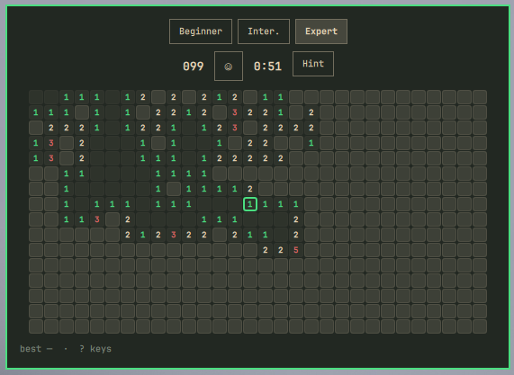

# Omamine

[](https://github.com/tcballard/omarchy-badges)

Classic Minesweeper for the Omarchy Quattro bar. Click the mine on the bar to
open a theme-aware board; play with the mouse or the keyboard.



## Install

```sh
omarchy plugin add https://github.com/raythurman2386/omamine.git --enable
```

Plugins run unsandboxed inside `omarchy-shell`. Read the source before you
enable it.

## Usage

Click the bar icon to open or close the board. Press Escape to close it.

| Input | Action |
| --- | --- |
| Left click / space / enter | Open a cell |
| Right click / `f` / `x` | Flag or unflag |
| Middle click / `c` | Chord a numbered cell |
| Arrows or `hjkl` | Move the cursor |
| `n` or the face | New game |
| Hint / `a` | Play one certain AI move (CS50 knowledge solver) |
| `1` `2` `3` | Beginner, Intermediate, Expert |
| `?` | Key list |
| Escape | Close |

The first click is always safe. Closing the panel keeps the board and the
timer running until the shell restarts. Best times and the last difficulty are
stored in the widget's `shell.json` entry.

Summon it from a keybind:

```sh
omarchy-shell shell toggle io.github.raythurman2386.omamine
```

Move the bar icon:

```sh
omarchy bar move io.github.raythurman2386.omamine --section right
```

## Remove

```sh
omarchy plugin remove io.github.raythurman2386.omamine
```

## Develop

```sh
omarchy plugin validate .
qmllint -I "$OMARCHY_PATH/shell" BarWidget.qml Panel.qml
node tests/game.test.js
node tests/solver.test.js
```

## Requirements

Omarchy 4 with the Quattro shell (Quickshell). No extra packages, network,
installer, or privileged helpers.

## License

MIT. The preview screenshot is of this plugin running on Omarchy.
